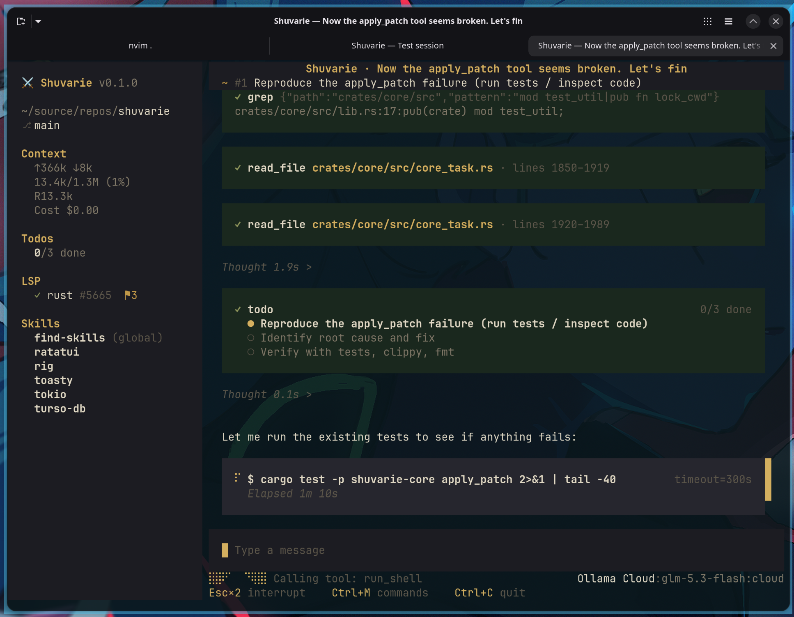

# <p align="center">⚔️⚜️ シュヴァリエ ⚜️⚔️

*Haiku:*
> *白き騎士*<br>
> *コードの闇へ*<br>
> *光差す*

*-- moonshotai/Kimi-K2.6*

[](./docs/demo-spec.md)

Let me tell you a story, True Soul.

Long ago the sages of Candlekeep foretold that a knight would come who keeps no castle of stone — his keep would be one of light, square and humming, ever-waiting behind the glass. And when the age of the terminal dawned, the prophecy stirred.

**Shuvarie** — シュヴァリエ, *the Chevalier* — is that knight: an AI companion sworn to your terminal. Armored in Rust, it rides wherever you point the quest — through the dungeons of legacy code, across the plains of half-written features, down into the Underdark of the build system. It reads the old scrolls, drafts new ones, mends what is broken; and it asks your leave before it strikes, for it fights by the code of chivalry.

In the plain tongue of innkeepers — the one that runs without dice — Shuvarie is a terminal-based AI coding agent: a Rust TUI around an agentic loop that edits files, runs commands, scrys your codebase, keeps its own chronicles, and gates every spell behind your permission wards.

*With Shuvarie, we can:*

- **Bind any patron** — OpenAI, Anthropic, Gemini, Ollama, or another OpenAI-compatible plane. One grimoire (`connections.kdl`) holds every pact, and its secrets live nowhere else.
- **Send a fully armed knight** — it reads and writes scrolls (files), forges patches, scrys with grep and glob, consults the LSP oracles for diagnostics, fetches tomes from the far webs, and lights the ritual circle (your shell) when the quest demands.
- **Rule by the code of chivalry** — every tool call passes the permission wards: allowed, denied, or brought before your seat. A denied incantation cuts the turn; a questionable one waits for your seal.
- **Swear oaths (scenes)** — change the knight's oath mid-campaign: each scene is a named bundle of system prelude, injected hooks, and a tool roster, forged in KDL.
- **Gather a party** — worker subagents ride out on their own errands with their own preambles and tools — or stand down by decree.
- **Walk the threads of fate** — every turn is a branch in a living tree: `/tree` to walk it, fork it, strike it from the tale; `/undo` and `/replay` to ride the roads not taken. No file is ever reverted — only fate re-chosen.
- **Employ scribes of Candlekeep** — when a quest outgrows the patron's memory, the elder scrolls are condensed into a summary while the recent past stays verbatim, and the ride goes on unbroken.
- **Fill the spellbook (skills)** — lay `SKILL.md` scrolls in `.agents/skills`; they are found, validated, shelved in the sidebar, and cast with `/skill:<name>`.
- **Raise your own heraldry (themes)** — the built-in banner is **Faerun**, dark and light-parchment both; forge a palette in KDL and the knight reads your terminal's mode at dusk and dawn.
- **Scry the chronicles (search)** — `Ctrl+R` first reads the plain ink (full-text search), then listens for omens (semantic embeddings), and fuses both into one vision.
- **Speak to the local spirits** — a prompt that begins with `!` never reaches the patron; it runs as your own shell command, inside the keep.
- **Honor the law of leave** — entering an untraveled workspace, the knight asks which scrolls it may read (context files, skills, configs) and remembers your answer.

*In order to introduce the knights into our barracks, we should:*

With [Nix](https://nixos.org) (flakes enabled), from a checkout:

```sh
nix run .            # try it
nix profile install .  # keep it
nix develop          # toolchain shell (rustc, cargo, clippy, rustfmt, rust-analyzer, just)
```

Or with a Rust toolchain:

```sh
cargo install --path .
```

*In order to give our knights the souls, we should:*

A knight unbound to a patron is steel and silence. Offer it a pact in `~/.config/shuvarie/connections.kdl` (debug builds keep their own hall at `~/.config/shuvarie-dev/` — the two never share). That file holds your API keys; the knight marks it with a warning, and so should you: share it with no one.

```kdl
active {
    provider "anthropic"
    model "claude-sonnet-4-5"
}
providers {
    provider id="anthropic" name="Anthropic" {
        kind "anthropic"
        api-key "sk-ant-…"
    }
}
```

Then launch `shuvarie` and choose your steed — provider and model — from the selectors. A hall without pacts greets you with the Welcome overlay: the knight waits at the gate.

*Words of command the knight obeys:*

- `!command` — speak to your local spirits; no word of it reaches the patron
- `/scene [name]` — swear another oath
- `/tree` — gaze upon the threads of fate; walk them, fork them, strike them from the tale
- `/undo`, `/replay` — turn back the wheel and ride the road again
- `/export [path]` — have this quest's chronicle scribed to JSON
- `/reload` — re-read the scrolls and spellbooks without leaving the saddle
- `/skill:<name> [args]` — cast a learned spell

The wards are set, the pact is sworn, the dice are cast. Ride forth, True Soul — the dungeon awaits. ⚔️
